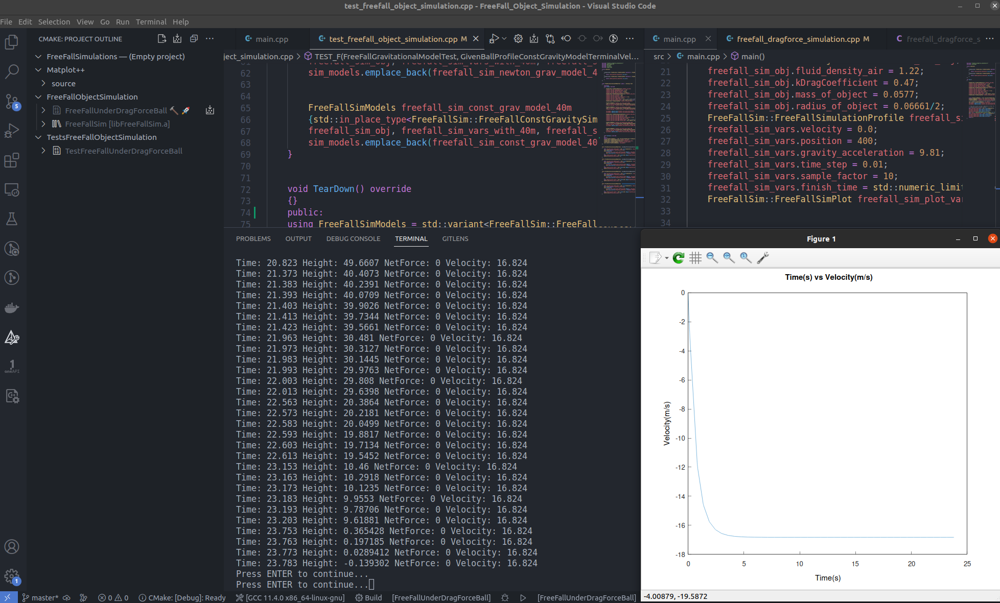

This project is simplified 1d version of Prof. Ryan Cooper work that can be found here:
https://cooperrc.github.io/computational-mechanics/module_03/02_Step_Future.html

The idea here is how to test basic kinematics motion concretely 

To install gnuplot on Ubuntu/Linux:
sudo apt-get update
sudo apt-get install gnuplot

To Install gtest:
sudo apt install libgtest-dev 

or

git clone https://github.com/google/googletest
cd googletest
mkdir build
cd build
cmake ..
make
make install

cd build (mkdir -p build if you so choose to clean entirely)
cmake ..
cmake --build .

./TestFreeFallUnderDragForceBall (to launch test written in Gtest)
./FreeFallUnderDragForceBall  (to launch main to see plot for the simulation)

